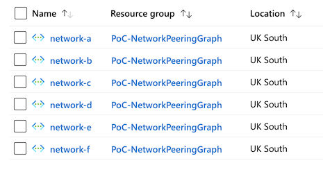
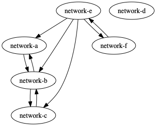

# Azure Virtual Network Peering Visualisation

Simple idea, visualise the peering relationships between Azure Virtual Networks. 

## Script

Script will take a network defintion (this is just to get them created)

``` powershell

$networkMap = @{
    "network-a" = @{
        AddressPrefix = "10.0.0.0/24"
        Subnets = @{
            "subnet-a" = @{ AddressPrefix = "10.0.0.0/24" }
        }
        Peerings = @{
            "peering-to-b" = @{ TargetNetwork = "network-b" }
        }   
    }
    # extras omitted for brevity
    "network-e" = @{
        AddressPrefix = "10.0.5.0/24" 
        Subnets = @{
            "subnet-a" = @{ AddressPrefix = "10.0.5.0/24"}
        }
        Peerings = @{
            "peering-to-a" = @{ TargetNetwork = "network-a"}
            "peering-to-b" = @{ TargetNetwork = "network-b"}
            "peering-to-c" = @{ TargetNetwork = "network-c"}
            "peering-to-f" = @{ TargetNetwork = "network-f"}
        }   
    }
    "network-f" = @{
        AddressPrefix = "10.0.6.0/24" 
        Subnets = @{
            "subnet-a" = @{ AddressPrefix = "10.0.6.0/24"}
        }
        Peerings = @{
            "peering-to-e" = @{ TargetNetwork = "network-e"}
        }   
    }
}

```

### Create Networks and Peerings
Deploy the resources and configure the networks 




### Visualise
Which we can then query and visualise, resulting in


